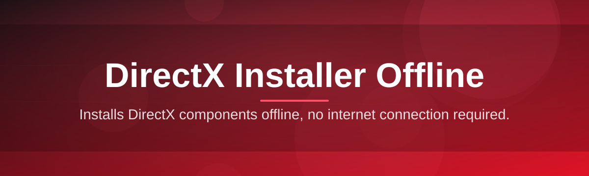

# directx-offline-installer-utility 🧊⚙️

  

*A single self-contained package that puts every DirectX runtime component on your machine — no browser, no background downloads, no waiting.*

  

---

## 🔍 Overview

**TL;DR:** This is an offline DirectX installer utility — a portable Windows tool that bundles the full DirectX End-User Runtime redistributable stack so you can install it once, anywhere, without an internet connection.

DirectX has always occupied a strange spot in the Windows ecosystem: it's foundational to how games and multimedia applications talk to your GPU, yet the "web installer" Microsoft ships fetches components piecemeal, silently, and only when it feels like it. That workflow assumes a fast, stable, always-on connection. In shared labs, air-gapped workstations, LAN party setups, or just a home connection that's having a bad day, that assumption falls apart. `directx-offline-installer-utility` exists to remove that dependency entirely — it's the DirectX installer offline enthusiasts and system builders have been assembling manually for years, packaged into one clean, predictable tool.

This project is built for a specific but wide audience: PC technicians re-imaging machines in bulk, gamers setting up rigs before ISPs get involved, IT departments maintaining offline software vaults, and hobbyists running retro or niche titles that still expect legacy DirectX 9 components alongside modern DirectX 11/12 runtimes. If you've ever hunted through forum threads for `dxwebsetup.exe` mirrors, this tool is the tidy end to that search — a maintained, transparent, offline-first alternative.

<blockquote>

**In short:** one executable, every runtime component, zero network requests during installation.

</blockquote>

---

## 🧩 What Sits Under the Hood

**TL;DR:** Eight capabilities, each solving a specific pain point tied to offline DirectX deployment.

- **Fully bundled runtime archive** — every redistributable component (D3DX9, D3DX10, D3DX11, XAudio, XInput, and managed DirectX libraries) ships inside the package, so nothing is fetched mid-install.

- **Silent and interactive modes** — run it with a visible progress interface for one-off machines, or trigger a silent pass for scripted deployment across a fleet of workstations.

- **Integrity-checked payload** — each bundled component is hash-verified before extraction, so a corrupted archive is caught before it ever touches your system directory.

- **Version-aware detection** — the utility scans existing DirectX component versions first and skips reinstalling anything already current, cutting install time on repeat runs.

- **Zero telemetry, zero background calls** — nothing phones home during or after setup. The tool doesn't need a connection to function, and it doesn't ask for one either.

- **Rollback-friendly logging** — every install step is timestamped and logged to a local file, so troubleshooting a failed component doesn't mean starting from zero.

- **Portable execution** — no installer-for-the-installer. Drop the executable anywhere, including a USB drive, and it runs identically.

- **Legacy + modern coverage** — bridges the gap between old-title DirectX 9 dependencies and current DirectX 12 feature levels in a single pass.

> [!TIP]
> If you manage more than one machine, pair the silent mode with your existing imaging pipeline — the utility exits with standard process codes so success or failure is easy to script around.

---

## 🚀 Getting Started

**TL;DR:** Visit the landing page, download the package, run it, follow four prompts — done in under a minute of active interaction.

1. **Visit the project landing page.** Use the download button above or below — it's the only official distribution point for this project.

2. **Download the utility.** It arrives as a single portable executable; no bundled installer wizard for the tool itself.

3. **Run it with administrator privileges.** DirectX components install into protected system folders, so elevation is required — Windows will prompt you automatically.

4. **Choose your install path.** Accept the default full-component install for the simplest experience, or expand the advanced panel to select specific runtime pieces.

> [!NOTE]
> First runs typically finish in under two minutes on modern hardware, since there is no download phase at all — the entire wait is local extraction and registration.

---

## 🖥️ System Requirements

**TL;DR:** Windows 10 or 11, no extra dependencies, works standalone out of the box.

| Requirement | Detail |
|---|---|
| Operating System | Windows 10 (64-bit) or Windows 11 |
| Disk Space | ~350 MB free during extraction |
| Privileges | Administrator (required for runtime registration) |
| Internet Connection | Not required — fully offline operation |
| Dependencies | None — the utility is self-contained |

> [!IMPORTANT]
> This tool targets 64-bit Windows builds. Legacy 32-bit systems are not part of the supported matrix for the 2026 release line.

---

## ⚙️ How It Works

**TL;DR:** Detect → verify → extract → register → confirm — a short, linear pipeline with no hidden network hops.

The internal workflow is intentionally simple, which is part of why it's reliable offline. When launched, the utility first scans the system for existing DirectX component versions, compares them against its bundled payload, verifies the integrity of what it's about to install, extracts only what's needed, and registers each component with the Windows component store before reporting a final status.

Each stage writes to the local log file mentioned earlier, so if `Register` fails for a specific component, you'll see exactly which one and why — rather than a generic failure code with no context.

---

## 🛟 Troubleshooting

**TL;DR:** Most issues trace back to permissions, antivirus interference, or a partially-downloaded package — all solvable in a few steps.

<strong>The installer won't launch — nothing happens when I double-click it.</strong>

Right-click the executable and choose "Run as administrator." DirectX component registration requires elevated privileges, and Windows sometimes suppresses the UAC prompt silently rather than showing an error.

<strong>My antivirus flagged the utility or quarantined it.</strong>

This is a known false-positive pattern for tools that extract and register system-level DLLs offline. Verify you downloaded from the official landing page linked in this README, then add a temporary exclusion if your vendor's heuristic engine is overly cautious.

<strong>A specific component fails during the Register step.</strong>

Check the local log file generated in the same folder as the executable. It records the exact component name and error code — usually resolved by ensuring no other setup process (like a game's own installer) is running simultaneously.

<strong>Can I use this without an internet connection at all?</strong>

Yes — that's the entire point of the project. Once downloaded, the utility never needs network access again. It's designed as a genuine DirectX installer offline solution, not a wrapper around a web fetch.

<strong>Does it work on older DirectX 9-era games?</strong>

Yes. The bundled payload includes legacy D3DX9 libraries alongside modern runtime components, so titles from either era are covered in the same pass.

<strong>How do I confirm the install actually succeeded?</strong>

The final screen shows a per-component summary table. You can also open the log file afterward — a clean run ends with a "Complete" status line for every registered component.

> [!WARNING]
> Do not interrupt the utility mid-extraction (closing the window or pulling a USB drive it's running from). This can leave partially-registered components that require a repeat run to fully resolve.

---

## 🎨 Interface, Shortcuts & Settings

**TL;DR:** A lightweight interface with keyboard-first navigation, a light/dark theme toggle, and a settings panel for advanced installs.

- **Keyboard shortcuts:**
  - `Enter` — proceed to next step
  - `Esc` — cancel current operation
  - `Ctrl + L` — open the local log file directly
  - `Ctrl + D` — toggle dark/light theme

- **Themes:** defaults to matching your Windows system theme, with a manual override available in Settings.

- **Settings panel includes:**
  - Component selection (full vs. custom)
  - Silent-mode toggle for scripted runs
  - Log verbosity (standard / detailed)

> [!NOTE]
> The interface deliberately avoids animations or transitions beyond basic fades — this keeps the tool responsive even on older hardware still catching up on legacy DirectX components.

---

## 🤝 Contributing & Community

**TL;DR:** Issues, pull requests, and discussion threads are welcome — this project grows through real-world deployment feedback.

If you've hit an edge case, found a component that doesn't register cleanly on a particular Windows build, or want to suggest an improvement to the silent-mode flags, open an issue. Pull requests are reviewed with an eye toward keeping the tool lightweight and dependency-free — that's the core design principle, and contributions that align with it move faster through review.

> Community members maintaining large device fleets have historically been some of the most valuable contributors here — their edge cases shape the reliability of every release.

  

---

## 📄 License

**TL;DR:** Released under the MIT License, 2026.

This project is distributed under the [MIT License](LICENSE). You're free to use, modify, and redistribute it under the terms outlined there.

---

## ⚖️ Disclaimer

**TL;DR:** This is an independent, unofficial utility — not a Microsoft product.

`directx-offline-installer-utility` is a community-maintained packaging tool and is not affiliated with, endorsed by, or officially connected to Microsoft Corporation. DirectX is a trademark of Microsoft. All bundled redistributable components remain the property of their original publishers; this project simply packages the official public runtime files for convenient offline deployment.

---

